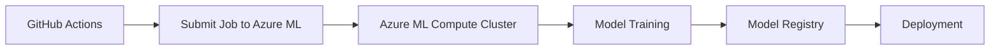

# 🎯 Where to Find Your Trained Models

This guide explains where your trained models are stored and how to access them in the Azure ML ecosystem.

## 🏗️ **Training Location: Azure ML Compute**

Your models are now trained on **Azure ML managed compute clusters**, not locally. Here's the complete flow:

### **1. Training Process**


- **GitHub Actions** submits training jobs to Azure ML
- **Azure ML Compute** runs the actual training
- **Trained models** are automatically registered in Azure ML Model Registry

### **2. Azure ML Compute Cluster Details**
- **Cluster Name**: `cpu-cluster`
- **VM Size**: `STANDARD_D2_V2` (configurable)
- **Scaling**: Auto-scales from 0 to 4 nodes
- **Location**: Same region as your Azure ML workspace

## 📦 **Model Storage: Azure ML Model Registry**

### **Primary Storage Location**
Your trained models are stored in the **Azure ML Model Registry** with:

- **Model Name**: `trained_model` (configurable via `MODEL_NAME` env var)
- **Versioning**: Automatic versioning (v1, v2, v3, etc.)
- **Metadata**: Performance metrics, tags, and training details
- **Artifacts**: Model files, preprocessing objects, and metrics

### **Registry Structure**
```
Azure ML Model Registry
├── trained_model (v1)
│   ├── model.pkl
│   ├── metadata.json
│   └── tags: {framework: scikit-learn, accuracy: 0.95}
├── trained_model (v2)
│   ├── model.pkl
│   ├── metadata.json
│   └── tags: {framework: scikit-learn, accuracy: 0.97}
└── ...
```

## 🔍 **How to Access Your Models**

### **1. Azure ML Studio (Web UI)**
Navigate to: `https://ml.azure.com`

1. **Open your workspace**
2. **Go to "Models"** in the left sidebar
3. **Find your model** by name (`trained_model`)
4. **View details**: metrics, versions, deployment status

### **2. Using Python SDK**
```python
from azureml.core import Workspace, Model

# Connect to workspace
ws = Workspace.from_config()

# List all models
models = Model.list(ws)
for model in models:
    print(f"Model: {model.name} v{model.version}")

# Get specific model
model = Model(ws, name='trained_model')
print(f"Model URL: {model.url}")
print(f"Model tags: {model.tags}")
```

### **3. Using Our Management Scripts**
```bash
# List all models
python azure_ml/model_management.py --action list

# Get model details
python azure_ml/model_management.py --action details --model-name trained_model

# Download a model
python azure_ml/model_management.py --action download --model-name trained_model

# Compare model versions
python azure_ml/model_management.py --action compare --model-name trained_model
```

### **4. Using Azure CLI**
```bash
# List models
az ml model list --workspace-name your-workspace --resource-group your-rg

# Show model details
az ml model show --name trained_model --workspace-name your-workspace --resource-group your-rg

# Download model
az ml model download --name trained_model --target-dir ./models --workspace-name your-workspace --resource-group your-rg
```

## 🚀 **Model Deployment Locations**

### **Staging Environment**
- **Service Name**: `trained_model-staging`
- **Compute**: Azure Container Instances (ACI)
- **Access**: Scoring URI provided after deployment
- **Purpose**: Testing and validation

### **Production Environment**  
- **Service Name**: `trained_model-production`
- **Compute**: Azure Container Instances (ACI) or Azure Kubernetes Service (AKS)
- **Access**: Scoring URI provided after deployment
- **Purpose**: Live inference serving

### **Finding Deployed Services**
```bash
# List all deployed services
python deployment/deploy_from_registry.py --action list

# Test a deployed service
python deployment/deploy_from_registry.py --action test --test-service trained_model-production
```

## 📊 **Monitoring and Tracking**

### **MLflow Integration**
- **Tracking**: All training runs are logged to MLflow
- **Location**: Integrated with Azure ML workspace
- **Access**: Via Azure ML Studio → Experiments

### **Training Job Details**
```python
from azureml.core import Workspace, Experiment

ws = Workspace.from_config()
experiment = Experiment(ws, 'model-training-experiment')

# Get latest run
runs = list(experiment.get_runs())
latest_run = runs[0]

print(f"Run ID: {latest_run.id}")
print(f"Status: {latest_run.status}")
print(f"Metrics: {latest_run.get_metrics()}")
print(f"Portal URL: {latest_run.get_portal_url()}")
```

## 🗂️ **File Structure in Azure Storage**

Your models are stored in Azure Blob Storage behind the scenes:

```
Azure Storage Account
└── azureml/
    └── ExperimentRun/
        └── dcid.{run-id}/
            ├── outputs/
            │   ├── model.pkl
            │   └── metrics.json
            └── logs/
                └── training_logs.txt
```

## ⚡ **Quick Access Commands**

### **Get Latest Model Info**
```bash
python -c "
from azureml.core import Workspace, Model
ws = Workspace.from_config()
model = Model(ws, 'trained_model')
print(f'Latest Model: {model.name} v{model.version}')
print(f'Accuracy: {model.tags.get(\"accuracy\", \"N/A\")}')
print(f'Created: {model.created_time}')
print(f'URL: {model.url}')
"
```

### **Download Latest Model**
```bash
python azure_ml/model_management.py --action download --model-name trained_model --target-dir ./my_models
```

### **Deploy Latest Model**
```bash
python deployment/deploy_from_registry.py --action deploy --model-name trained_model --service-name my-model-service
```

## 🔐 **Access Control**

- **Workspace Access**: Requires Azure ML workspace permissions
- **Model Registry**: Inherits workspace permissions
- **Deployed Services**: Can be configured with authentication keys
- **Storage Access**: Managed by Azure ML service

## 🆘 **Troubleshooting**

### **Model Not Found**
1. Check if training job completed successfully
2. Verify model was registered (check job logs)
3. Confirm you're connected to the correct workspace

### **Access Issues**
1. Ensure you have proper Azure ML workspace permissions
2. Check if service principal has Model Registry access
3. Verify Azure CLI/SDK authentication

### **Download Issues**
1. Check network connectivity to Azure
2. Verify sufficient local storage space
3. Ensure proper authentication

## 📚 **Additional Resources**

- **Azure ML Documentation**: https://docs.microsoft.com/en-us/azure/machine-learning/
- **Model Management**: https://docs.microsoft.com/en-us/azure/machine-learning/how-to-manage-models
- **MLflow Integration**: https://docs.microsoft.com/en-us/azure/machine-learning/how-to-use-mlflow

---

## 🎉 **Summary**

Your models are now:
- ✅ **Trained on Azure ML compute** (scalable and managed)
- ✅ **Stored in Azure ML Model Registry** (versioned and tracked)
- ✅ **Deployed from the registry** (consistent and reliable)
- ✅ **Monitored with MLflow** (full experiment tracking)
- ✅ **Accessible via multiple methods** (UI, SDK, CLI, scripts)

This provides a complete MLOps solution with enterprise-grade model management! 🚀